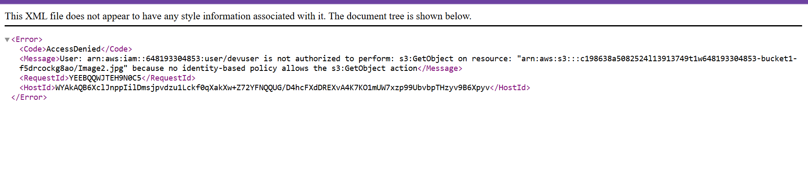

## Initial Access Observations
## 1. Initial IAM User Access (devuser)
When logged in as devuser, the following behaviors were observed:

No permission to launch EC2 instances

Limited IAM visibility (no iam:GetAccountSummary)

Ability to create new S3 buckets

Inability to upload objects to newly created buckets

Inability to download objects from bucket1 and bucket2

## Governance Interpretation

The attached identity-based policy (DeveloperGroupPolicy) granted limited S3 bucket-level permissions but did not allow object-level actions such as:

s3:PutObject

s3:GetObject

This demonstrates enforcement of least privilege at the object layer.

