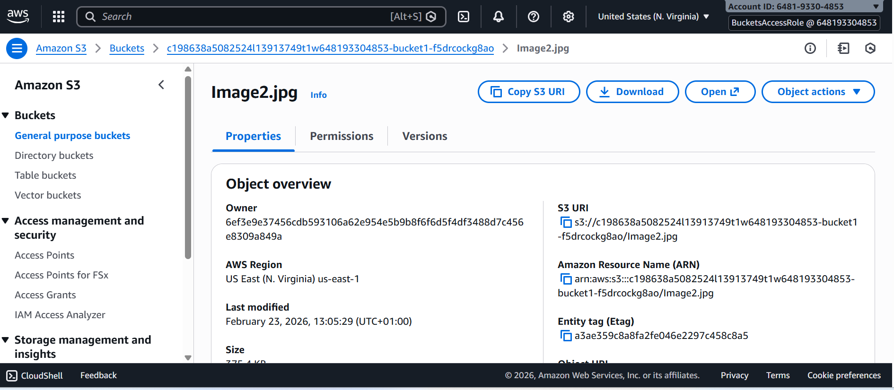
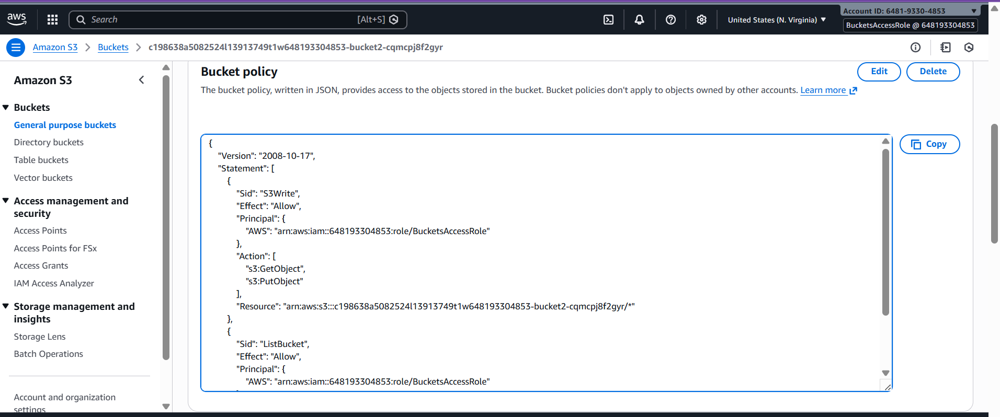

## Initial Access Observations
## 1. Initial IAM User Access (devuser)
When logged in as devuser, the following behaviors were observed:

No permission to launch EC2 instances

Limited IAM visibility (no iam:GetAccountSummary)

Ability to create new S3 buckets

Inability to upload objects to newly created buckets

Inability to download objects from bucket1 and bucket2

## Governance Interpretation

The attached identity-based policy (DeveloperGroupPolicy) granted limited S3 bucket-level permissions but did not allow object-level actions such as:

s3:PutObject

s3:GetObject

This demonstrates enforcement of least privilege at the object layer.

## 2. Role Assumption: BucketsAccessRole
After assuming the BucketsAccessRole, access behavior changed:

Successful download from bucket1

Visibility of all S3 buckets

Inability to view IAM user groups

Successful upload to bucket2 (unexpected based on role policy review)

## Governance Interpretation

This demonstrated:

Temporary privilege escalation via AWS STS

Segregation of duties between IAM user and IAM role

Policy evaluation changes based on assumed role context

## 3. Identity-Based vs Resource-Based Policy Interaction

Although the IAM role policy (GrantBucket1Access) did not explicitly grant s3:PutObject access to bucket2, the upload to bucket2 succeeded.

Upon inspection, bucket2 contained a resource-based policy granting:

s3:GetObject

s3:PutObject

s3:ListBucket

to the BucketsAccessRole principal.

## Governance Insight

AWS evaluates access by combining:

Identity-based policies

Resource-based policies

Explicit denies (if any)

Because there was no explicit deny and bucket2’s resource policy allowed the action, access was granted.

This highlights how resource-based policies can expand effective permissions beyond identity-based policy expectations.

