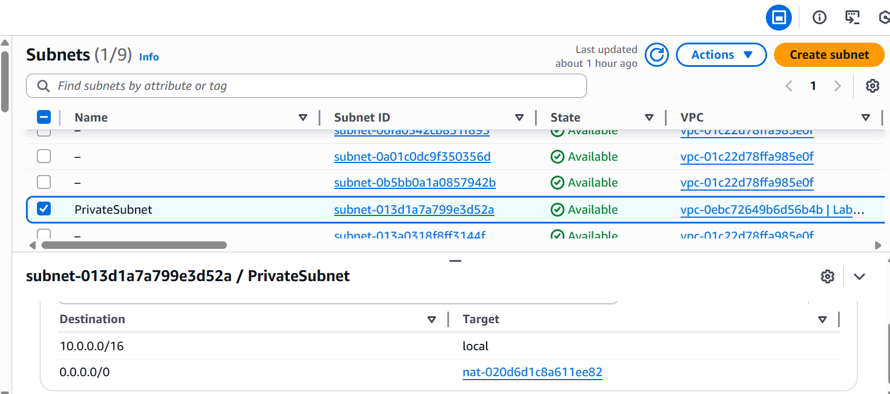

# Architecture & Segmentation Analysis
## 1. Private Subnet Routing Validation
### Activity Performed

Reviewed the route table associated with the private subnet.

Confirmed:

10.0.0.0/16 → local

0.0.0.0/0 → NAT Gateway

### Analysis

The private subnet does not have a direct route to the Internet Gateway.

This ensures:

- No inbound internet traffic reaches private resources

- Outbound traffic is mediated via NAT

- Public IP assignment is unnecessary for internal services

This configuration demonstrates controlled egress design and exposure minimization.
## 2. Public Subnet Routing Validation

Public subnets route 0.0.0.0/0 to the Internet Gateway.

This enables internet-facing proxy servers while preserving private segmentation for backend resources.

### Governance Insight

The architecture demonstrates basic segmentation, but routing alone does not enforce access control security groups and NACLs must complement segmentation.
