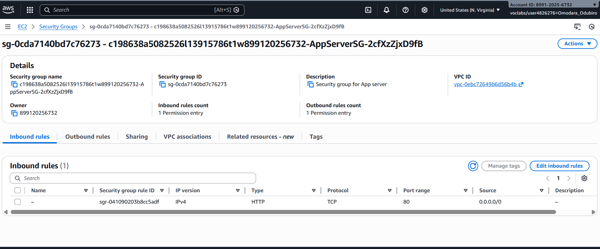
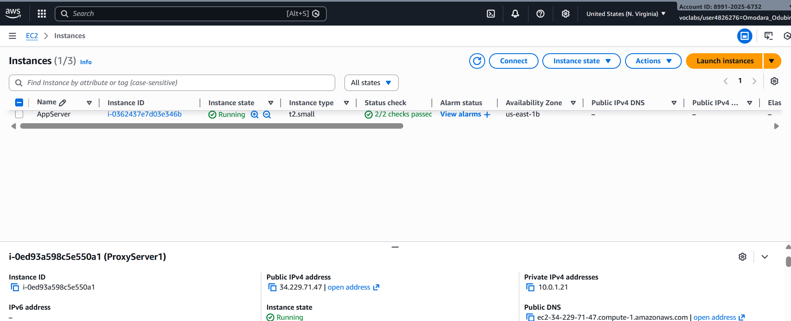
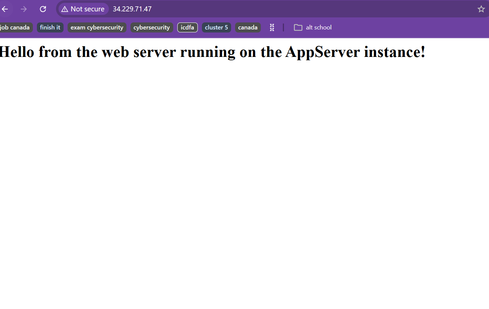
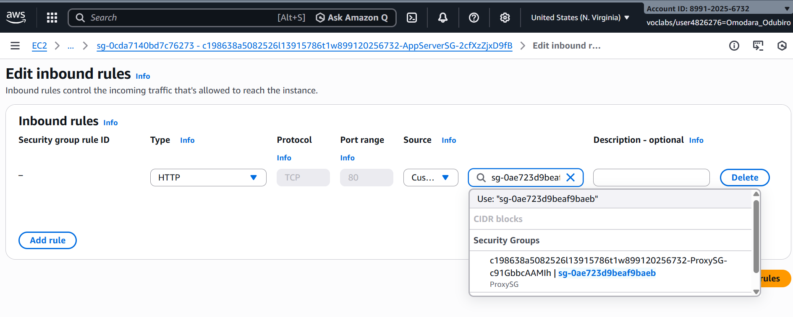
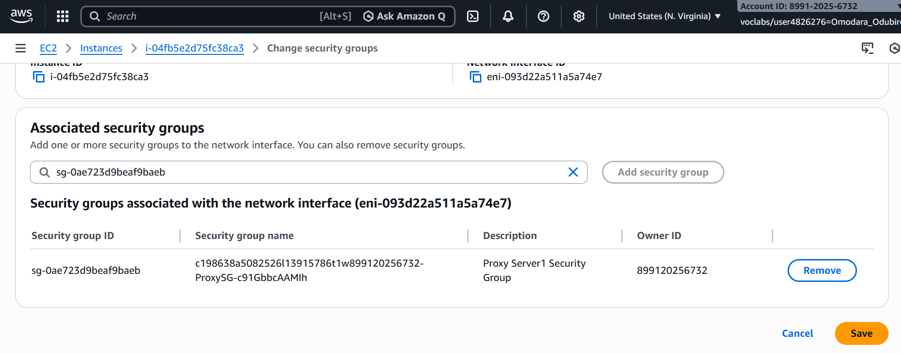

# Security Group Hardening & Least Privilege
## 1. Baseline Security Group Assessment

Initial AppServerSG configuration:

Inbound:

HTTP (80)

Source: 0.0.0.0/0

### Risk Analysis

Allowing inbound traffic from 0.0.0.0/0 increases attack surface.

Although the AppServer resides in a private subnet, overly permissive rules contradict least privilege principles.

## 2. IP-Based Restriction

Replaced 0.0.0.0/0 with:

ProxyServer1PublicIP/32

Result:

ProxyServer1 → Access Granted

ProxyServer2 → Access Denied
### Governance Evaluation

Benefits:

- Reduced lateral movement risk

- Precise access control

Limitation:

- Not scalable

- Operationally rigid

- Vulnerable to IP changes
## 3. Security Group Referencing (Scalable Control)

Replaced IP rule with:

Allow HTTP from ProxySG

Assigned ProxySG to both proxy servers

### Governance Strength

Security group referencing:

- Enables role-based segmentation

- Supports auto-scaling environments

- Eliminates static IP dependency

- Aligns with Zero Trust architecture

This represents mature cloud network design.
