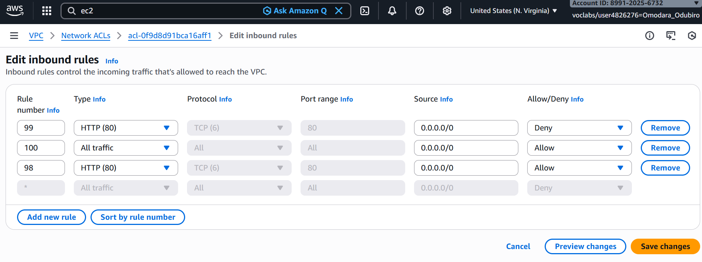

# Network ACL Evaluation – Defense in Depth
## 1. Deny Rule Implementation

Added NACL Rule 99:

Deny TCP 80

Result:
Traffic blocked despite security group allowing it.

## 2. Rule Order Validation

Added Rule 98:

Allow TCP 80

Traffic restored.

### Key Observations

- NACLs are stateless

- Security groups are stateful

- NACL rules evaluated numerically (lowest first)

- Both layers must allow traffic

### Governance Insight

NACLs provide subnet-level enforcement and act as secondary containment control.

This validates defense-in-depth implementation.

