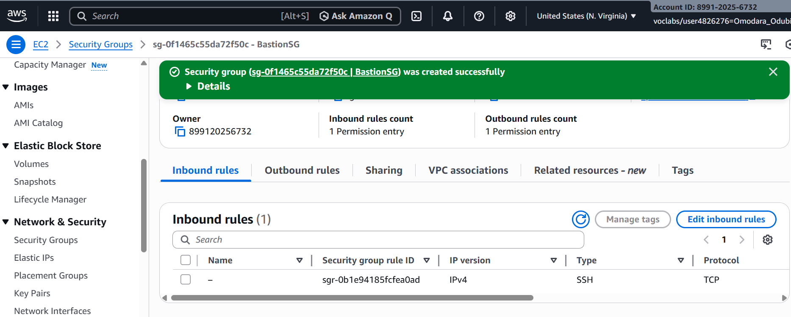

# Administrative Access Model Evaluation
## 1. Bastion Host Model

Configured SSH access through bastion host in public subnet.

Opened:

Port 22 (SSH)

Used SSH agent forwarding to access AppServer.

.png)

### Risk Assessment
