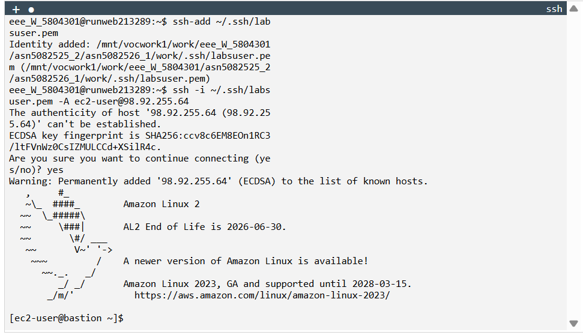
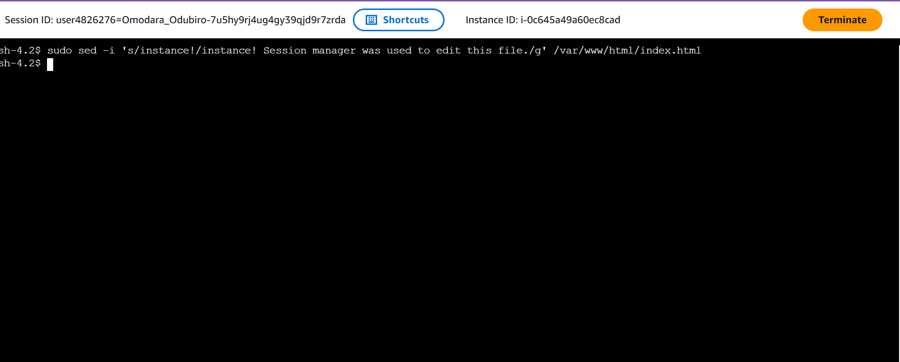

# Administrative Access Model Evaluation
## 1. Bastion Host Model

Configured SSH access through bastion host in public subnet.

Opened:

Port 22 (SSH)

Used SSH agent forwarding to access AppServer.

### Risk Assessment
- Publicly exposed SSH port

- Key management complexity

- Increased attack surface

- Potential brute-force exposure

Operational but risk-prone.

## 2. AWS Systems Manager Session Manager

Connected to AppServer without opening port 22.

IAM-based access control.

### Governance Evaluation

Advantages:

- No inbound SSH exposure

- IAM-based role control

- Auditable session logging

- Reduced attack surface

- Centralized compliance visibility

### Governance Recommendation

Session Manager is the preferred administrative access model due to:

- Lower external exposure risk

- Enhanced auditability

- Alignment with cloud-native security practices
