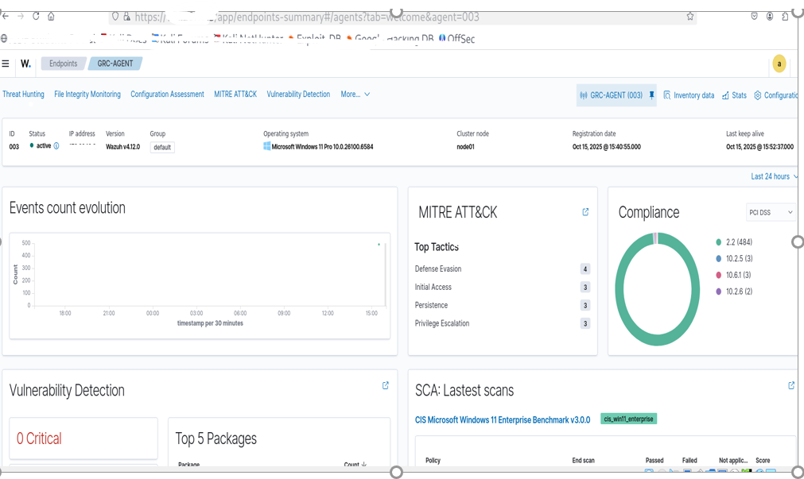
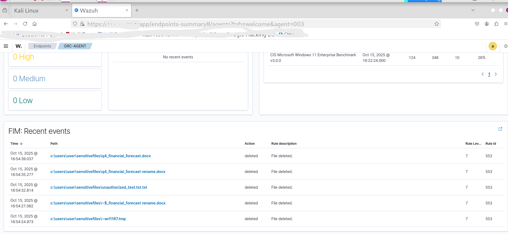
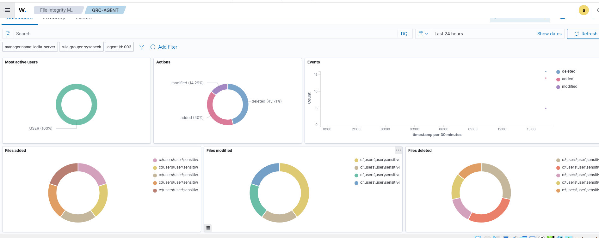

# SIEM-Based File Integrity Monitoring (FIM) Control Evaluation

*(Governance & Technical Effectiveness Review – Wazuh)*

## 1. Executive Overview

This project evaluates the effectiveness of a File Integrity Monitoring (FIM) detective control implemented using Wazuh SIEM in a simulated financial services environment.

The objective was to:

* Assess risk associated with unauthorized modification of sensitive financial files
* Validate monitoring capability and alert generation
* Evaluate governance reporting readiness
* Demonstrate audit evidence generation
* Map technical control performance to compliance expectations

This assessment bridges SOC-level monitoring with GRC oversight.

## 2. Risk Context & Business Impact

### Identified Risk

Unauthorized modification, deletion, or creation of sensitive financial documents.

### Business Impact Analysis

**Financial Impact**

* Inaccurate financial reporting
* Budget misalignment
* Direct financial exposure

**Operational Impact**

* Disruption of executive decision-making
* Audit discrepancies
* Compliance violations

**Reputational Impact**

* Loss of stakeholder trust
* Increased regulatory scrutiny

This risk was categorized as **High Impact** due to regulatory and financial sensitivity.

## 3. Control Architecture

### Primary Control

Detective Control – File Integrity Monitoring (FIM)

The Wazuh SIEM solution monitors:

* File creation
* File modification
* File deletion
* Timestamp of activity
* User/account involved
* System agent reporting status

### 📸 Screenshot 1 – FIM Dashboard Overview

 The dashboard provides centralized visibility into file change activity across monitored endpoints. Alert metrics enable risk quantification and trend analysis.

## 4. Risk Scenario Simulation

To test control effectiveness, a simulated unauthorized file modification was performed outside standard business hours.

The objective was to validate:

* Real-time alert detection
* Log accuracy
* Timestamp reliability
* Evidence retention

### 📸 Screenshot 2 – File Modification Alert

The FIM alert captured modification activity, including timestamp and affected file path. This confirms the control’s ability to detect unauthorized changes in monitored directories.

## 5. Alert Analysis & Evidence Validation

Event details were reviewed to assess:

* Frequency of modification attempts
* User activity patterns
* Time-of-day anomalies
* Consistency of agent reporting

### 📸 Screenshot 3 – Filtered Log View by Date Range

Filtering by date range and file path allows validation of file integrity over a defined audit period. Absence of modification alerts during a quarter demonstrates effective control operation.

## 6. Control Lifecycle Alignment

This evaluation considered the full control lifecycle:

| Control Type | Example                                                    | Purpose                                        |
| ------------ | ---------------------------------------------------------- | ---------------------------------------------- |
| Preventive   | Role-Based Access Control (RBAC), ACLs                     | Reduce likelihood of unauthorized modification |
| Detective    | Wazuh File Integrity Monitoring                            | Detect and log file changes                    |
| Corrective   | Restore from backup, revoke access, incident investigation | Mitigate and remediate impact                  |

This layered approach strengthens overall governance posture.

## 7. Governance & Compliance Mapping

The centralized SIEM logs support:

* Tamper-evident activity records
* Change control audit trails
* Checksum validation
* Time-bound reporting capability

This aligns with regulatory expectations under:

* SOX – Change Management Controls
* PCI DSS – File Integrity Monitoring requirements
* HIPAA – Data Integrity Safeguards

## 8. Audit Demonstration Scenario

To demonstrate that a specific financial file remained unmodified during a reporting period:

1. Logs were filtered by file path and time range
2. No modification alerts were detected
3. Latest checksum was reviewed for validation

This provided audit-ready evidence of file integrity.

## 9. Key Findings

* FIM control successfully detected file modification events
* Centralized logging improves governance visibility
* SIEM filtering enables structured audit reporting
* Preventive controls must complement detective controls
* Agent uptime is critical for continuous monitoring

## 10. Conclusion

This project demonstrates the ability to:

* Evaluate technical controls through a governance lens
* Translate SIEM alerts into risk language
* Align monitoring capability with compliance frameworks
* Assess detective control effectiveness
* Produce audit-ready evidence

This strengthens integration between SOC monitoring and GRC oversight functions.
